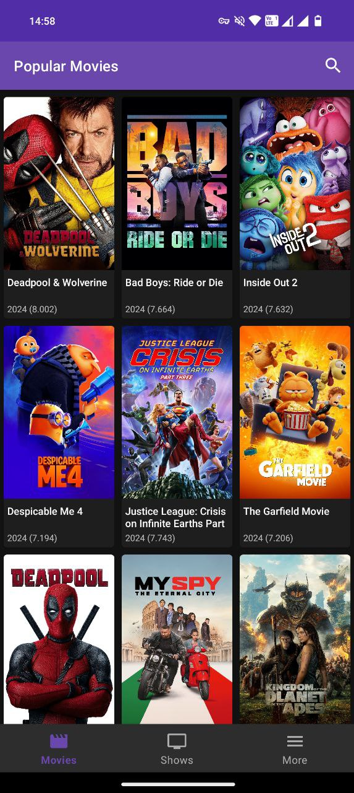
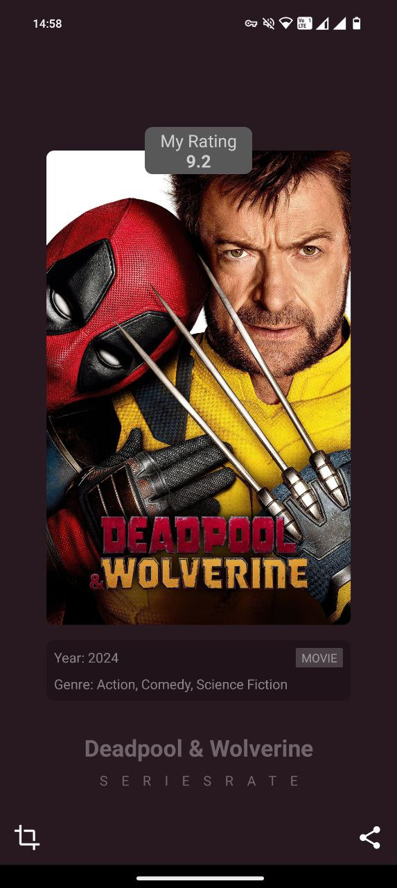

## Task Description: Popular Movies and TV Shows App

### Objective
Create a mobile application using **Kotlin**, **Jetpack Compose**, **Coroutines**, **OkHttp**, and **Retrofit** to fetch and display popular movies and TV shows from the TMDb API.

### API Key Setup
To access the TMDb API, an API key is required. Follow these steps to set it up:

1. **Obtain API Key**: 
   - Visit [TMDb's API documentation](https://developer.themoviedb.org/reference/intro/getting-started) to obtain your API key.

2. **Store API Key**: 
   - Add the API key to your `local.properties` file in your project directory. Include the following line:
     ```
     TOKEN=your_api_key_here
     ```
   Replace `your_api_key_here` with the actual key obtained from TMDb.

### Application Features

1. **Tabs and Navigation**:
   - The app should feature two main tabs: one for "Popular Movies" and another for "Popular TV Shows".

2. **Listings**:
   - Each tab should display a list of popular items retrieved from the TMDb API. 
   - For each item, display basic information such as the title, poster image, and release date.

3. **Detail Screen**:
   - Upon selecting a movie or TV show from the list, navigate to a detail screen.
   - This screen should present comprehensive information, including:
     - Title
     - Synopsis/Overview
     - Release Date
     - Ratings
     - Genre
     - Poster and other media (if available)

4. **Search Functionality**:
   - Include a search action that allows users to search through the movies and TV shows. 
   - The search results should display in the same format as the popular items list, with options to view details.

### Design and UI

The design of the app screens, as provided, includes:

- **Tab Layout**: Two tabs at the bottom for easy navigation between Movies and TV Shows.
- **List Screen**: A vertical grid with item thumbnails, titles, and brief details.
- **Detail Screen**: A structured layout with a large banner or poster, followed by detailed information and media.

Please refer to the attached design mockups for precise visual guidance and layout specifications.

 

### Implementation Guidelines

- **Technologies**: 
  - **Kotlin**: The app should be developed using Kotlin.
  - **Jetpack Compose**: Utilize Jetpack Compose for building the UI components.
  - **Coroutines**: Implement coroutines for asynchronous programming, ensuring efficient API data fetching and UI updates.
  - **OkHttp**: Use OkHttp for efficient HTTP & HTTPS network calls.
  - **Retrofit**: Integrate Retrofit for type-safe HTTP client communication, simplifying the API call process and data handling.

- **UI/UX Considerations**: Ensure smooth navigation and a responsive interface. Prioritize user experience, making sure the app is intuitive and easy to use.


### Additional Notes
- Ensure that the app handles errors gracefully, providing user-friendly messages in case of issues such as network errors or missing data.

By following this documentation, you will build a functional and user-friendly app that meets the specified requirements. Good luck!
